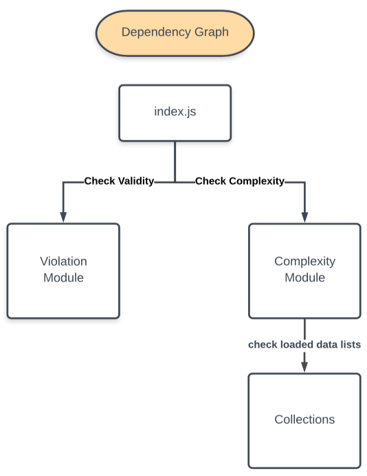

# Password Validator
> A command-line tool 
> for rating a password ❌Invalid ⚠️Weak or ✅Strong

## Approach & Design Decisions

Enclosed is a simplified dependency graph for the functional modules created.



I determined the logic required to be handled by each unit and created an initial directory structure, moving functionality into folders as I went along.

I created the root file which is index.js (a default hook used for the Node.js modular system) and decided the functionality that should be their own modules were
	- the validators
	- the word collections
	- the passwordRater itself 


The root module, found at index.js., is dependent on two modules which handle validation
-complexityValidators module
-violationValidators module

Each validation module has its own methods. The tool validates the following categories using these validation methods.

- [x] At least 6 characters long
- [x] Shorter than 24 characters long <em>(additional)</em> 
- [x] Not composed of repeated characters
- [x] Not composed of a digit sequence
- [x] Not composed of an alphabetic sequence
- [x] No "Guessable" inputs (bad and common paswords)
- [x] No Proper Names
- [ ] No Dictionary Words (🐞 bugfix required)
- [x] No Keyboard Patterns (eg. qwerty or ytrewq)

### Extensibility 
* The validation modules are organized in such a way as to permit the addition of additional violation or complexity-evaluation methods.

### Readability
* I clearly documented the purpose, inputs, and outputs of all functions with annotations. All  functions are written plainly and without the use of external libraries (such as lodash).

## Instructions

1. Ensure Node is installed with ```node -v```
1. If not installed, visit [Node.js](https://nodejs.org/en/download/). Any version >5.0 will do.
1.  ``` npm install```
1. ```npm start```
